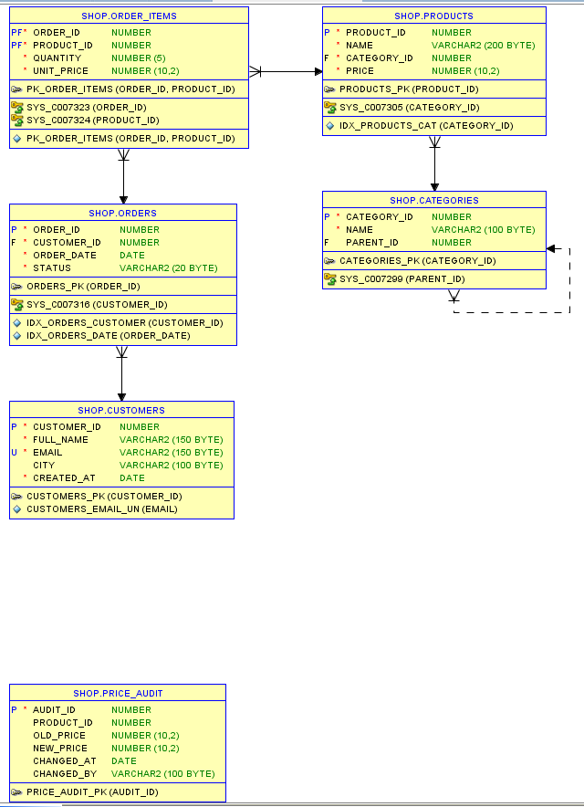

# Oracle Shop: учебный проект по SQL и PL/SQL

Учебная база данных интернет-магазина на **Oracle Database 11g Express Edition**. Проект показывает полный цикл работы с базой: проектирование схемы, наполнение тестовыми данными, аналитические запросы, PL/SQL и оптимизация по плану выполнения.

## Что внутри

| Файл | Содержание |
| --- | --- |
| `01_schema.sql` | 6 таблиц, последовательности, ограничения, индексы |
| `02_data.sql` | справочники и генерация данных: 200 клиентов, 2000 заказов, около 4000 позиций |
| `03_queries.sql` | 6 аналитических запросов |
| `04_plsql.sql` | процедура, функция, триггер аудита цен |
| `05_optimization.sql` | сравнение планов выполнения с индексом и без него |
| `er_diagram.png` | ER-диаграмма |
| `screenshots/` | результаты выполнения скриптов |

## Схема данных



- `categories`: категории товаров, иерархия через `parent_id` (категория и подкатегории)
- `products`: товары, ссылка на категорию
- `customers`: клиенты, уникальный email
- `orders`: заказы со статусами `NEW`, `PAID`, `SHIPPED`, `CANCELLED`
- `order_items`: позиции заказа с ценой на момент покупки (составной первичный ключ)
- `price_audit`: журнал изменения цен, заполняется триггером. Внешнего ключа к `products` нет намеренно: записи журнала должны сохраняться, даже если товар удалят.

## Как запустить

1. Установить Oracle Database 11g XE (подойдёт и более новая версия) и Oracle SQL Developer.
2. Под администратором создать пользователя:

```sql
CREATE USER shop IDENTIFIED BY ShopPass123
  DEFAULT TABLESPACE users QUOTA UNLIMITED ON users;
GRANT CONNECT, RESOURCE TO shop;
GRANT CREATE VIEW, CREATE SYNONYM TO shop;
```

3. Подключиться под `shop` и выполнить скрипты по порядку: `01` → `02` → `03` → `04` → `05` (в SQL Developer: Run Script, клавиша F5).

Данные генерируются случайно, поэтому конкретные цифры в запросах 1–3 при повторном запуске будут отличаться.

## Использованные приёмы

- DDL и ограничения целостности: `PRIMARY KEY`, `FOREIGN KEY`, `UNIQUE`, `CHECK`, `DEFAULT`
- Последовательности (`SEQUENCE`) вместо identity-столбцов, потому что в 11g их нет
- Соединения `JOIN`, агрегация `GROUP BY`, топ-N через `ROWNUM`
- Оконные функции `RANK`, `LAG`
- CTE (`WITH`), `NOT EXISTS`, `MERGE`
- Иерархический запрос `CONNECT BY`
- PL/SQL: процедура с обработкой исключений, функция, триггер `AFTER UPDATE`
- Анализ планов: `EXPLAIN PLAN`, `DBMS_XPLAN`, `DBMS_STATS`

## Примеры результатов

### Проверка данных

После выполнения `02_data.sql`: 6 категорий, 10 товаров, 200 клиентов, 2000 заказов, 4014 позиций.


### Топ-5 клиентов по выручке


### Рейтинг товаров внутри категории


### Выручка по месяцам и рост к предыдущему месяцу


Первый и последний месяцы в выборке неполные (данные за скользящий год), поэтому рост в них нужно трактовать осторожно.

### Дерево категорий


### PL/SQL: процедура, функция и триггер

Триггер записал изменение цены товара 29990 → 27990 в `price_audit`. Процедура `add_order_item` взяла уже обновлённую цену, а функция `order_total` вернула сумму заказа 110970 (2 × 27990 + 54990).


## Оптимизация: составной индекс

Для таблицы `orders_big` (200 000 строк) создан составной индекс `(customer_id, order_date)`: первым стоит столбец с условием на равенство, вторым диапазонный.

| Вариант | Операция в плане | Cost |
| --- | --- | --- |
| Без индекса (подсказка `FULL`) | `TABLE ACCESS FULL` | 220 |
| С индексом `idx_big_cust_date` | `INDEX RANGE SCAN` + `TABLE ACCESS BY INDEX ROWID` | 29 |

Для запроса по одному клиенту за неделю оценка стоимости упала примерно в 7,5 раза.

Без индекса, `Cost = 220`:


С индексом, `Cost = 29`:


**Вывод.** Индекс помогает только на селективных условиях. Для запроса по тому же клиенту за девять месяцев (около 900 строк из 200 000) оптимизатор остался на полном сканировании с Cost 220, и это правильный выбор: чтение такого числа строк через индекс обошлось бы дороже.


## Автор

[Имя Фамилия], выпускница Воронежского государственного технического университета (2024). Ищу позицию в поддержке SQL или разработке на SQL.

Контакты: [email] · [телефон / Telegram]
